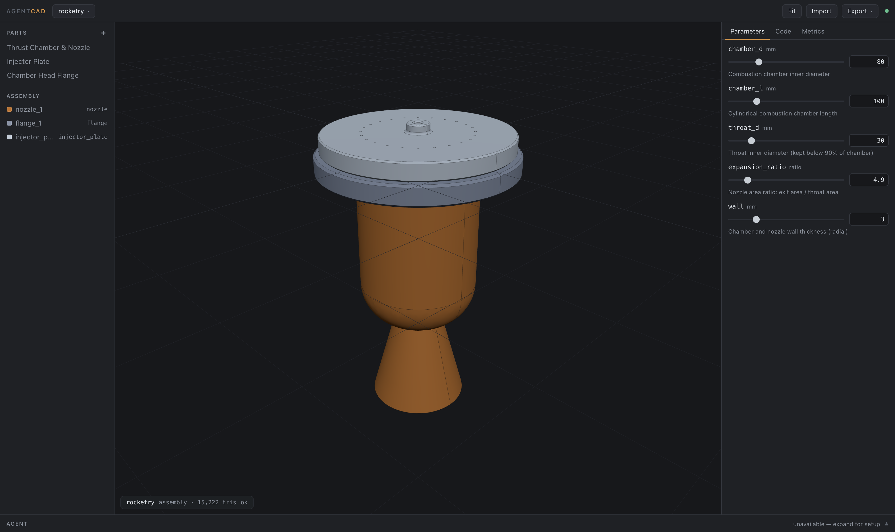

# AgentCAD

**Agentic-first parametric CAD for complex parts and systems** — rocketry,
construction, prototyping. Real B-rep solid modeling (OpenCascade via
[build123d](https://build123d.readthedocs.io)), a browser UI, and AI agents
as first-class users. Runs on macOS today; the architecture is
Windows/Linux-ready.



## Why agentic-first

Traditional CAD encodes design intent in click-history feature trees that
only the authoring application can interpret. AgentCAD makes the opposite
bet: **the model is code**. Every part is a small parametric Python script —
the representation language models read, write, diff, and review best.
Humans steer and review; agents author and iterate.

The second bet: **the kernel is the referee**. Every change an agent makes is
validated by real geometry — B-rep validity, volume, mass, bounding box,
interference between assembly components — and every failure returns as
structured data (traceback, failing line, hints), so agents self-correct in a
tight loop instead of hallucinating geometry.

The full tool surface is defined once and exposed twice: as an **MCP server**
for any MCP client (Claude Code, Claude Desktop, ...) and as a **built-in
chat agent** in the UI. The browser UI, the chat agent, and external agents
are peers — same service, same events, same files.

## Capabilities

On top of parametric script parts and validated assemblies, AgentCAD adds:

- **Import existing CAD** as *reference* parts. STEP/BREP load as real
  B-reps (measure, place in assemblies, boolean against script parts); STL
  loads mesh-only (display/measure — booleans on a mesh segfault OCCT and
  are blocked at the loader). Uploads are capped at 100 MB.
- **A parts library and package registry** — "pip for parts". A package is a
  directory of parametric parts identified by a canonical **content-tree
  digest**; a directory or a **git repository** is an index; a project records
  what it depends on in two additive, machine-fact-free manifest maps that
  merge clean. `agentcad publish` runs a nine-stage gate that builds every
  part at **each parameter's declared range and every shipped configuration**,
  runs its specs there, and mates every connector — the gate *is* the
  curation. Nine COTS packages ship in `catalog/` (ISO 4762/4014/7380 screws,
  heat-set inserts, DIN 625 bearings, 2020/3030 extrusion, NEMA 17/23) and
  answer with no network and no configuration. `use_part` copies a part in
  under an immutable provenance header, so a project builds with no cache, no
  index and no network. **The publish gate is a correctness gate, not a
  security boundary** — see [docs/packages.md](docs/packages.md).
- **Materials with engineering properties.** 30 curated materials carry
  density plus optional modulus, yield/ultimate strength, CTE, conductivity,
  service temperature, and cost. A three-layer resolver (builtin <
  `~/.agentcad/materials.json` < a project's `materials` section) lets you
  add alloys. Values are typical datasheet figures, **not design allowables**.
- **Declarative assembly mates.** A part script can declare named connectors
  (`connectors(p, part)`); an instance can be mated rigid / revolute /
  cylindrical to another, and the service resolves the chain to concrete
  transforms at read time (cycles rejected).
- **2D engineering drawings.** Projected front/top/right/iso views with
  overall dimensions and hole callouts *detected from the geometry*, as SVG
  or DXF.
- **Geometric analysis.** Cross-section area, minimum wall thickness,
  projected (silhouette) area, and the full inertia tensor ship in the core;
  linear-static FEM is an optional extra (`agentcad[fem]`).
- **A part-authoring toolkit.** `safe_fillet` / `safe_shell` / `safe_bool`
  survive the common OCCT failures, a scipy constraint solver turns a
  dimensioned sketch — lines, arcs, ellipses, splines and slots, with
  tangency, symmetry, equality and concentricity — into exact coordinates
  (and into the build123d source that rebuilds them), and `bd_warehouse`-backed
  helpers add ISO threads and fasteners — all importable from part scripts.
  An **Error Doctor** rewrites raw OCCT errors into plain-language fixes.

- **Branching version control.** A project is a real git repository, so it
  gets branches with independent histories (one materialized working tree
  each, per-client checkouts, shared mesh cache), immutable named versions
  (tags) you can restore, and **semantic merges**: part scripts merge as text,
  `project.json` merges key-wise (per part, parameter, instance, material), and
  every merge is revalidated by the kernel — a merge that breaks a build,
  strands an instance, or introduces interference is blocked unless you land it
  deliberately. Conflicts come back as structured data with base/ours/theirs.

- **Change proposals (CAD pull requests).** A branch can be packaged as a
  reviewable change — title, argument, and an auto-generated **review packet**:
  per-part script and PARAMS diffs, metric deltas, assembly deltas, before/after
  renders sharing one camera frame, and a **kernel-computed geometric diff**
  (added/removed mm³ plus translucent overlay solids in the viewport). The
  lifecycle is governed (draft → open → approved / changes-requested → merged /
  closed), every action is attributed as human or agent in an append-only audit
  log, and merging only happens through the gate: one non-author approval by
  default, plus PRD-001's kernel validation, with any override recorded.

- **Executable design specs.** Design intent lives in the model as code: a
  `SPECS` list in a part script (`check_wall(min_mm=2.5, requirement="ENG-014")`,
  `check_mass(max_g=120)`, arbitrary predicates) and a project `specs.py` for
  assembly intent (clearances, interference, tolerance stack-ups). Every
  rebuild evaluates them and reports pass/fail/skip beside the metrics — a
  failing spec never blocks the edit, it just turns the inspector chip red —
  `run_specs` gives the full report grouped by requirement id, and a proposal
  whose specs are red (or were never evaluated) **cannot be merged**. TDD for
  hardware: state the budget once, and every later change is refereed against
  it.

- **Navigation that survives scale.** Parts and assembly instances take
  folders and tags — project metadata, so scripts stay flat in `parts/` and
  organizing never rebuilds anything. A type-to-filter box (`/`) narrows the
  tree live in one query language shared with the `search_parts` agent tool:
  `state:error tag:printed material:al6061 boss` composes free text over script
  bodies with structured filters. Every row carries a server-rendered
  thumbnail, cached by the part's content hash and served `immutable`. A
  multi-selection gets a bulk bar — material, tags, folder, export, delete —
  and each bulk change is **one** undo step, not one per part. The project
  switcher is a dashboard of cards with hero renders, part counts, mass and a
  failing-build badge. A 1 000-part tree renders a few dozen rows.

- **Agent skills.** Craft knowledge as a first-class, versioned, loadable
  artifact: sixteen shipped guides (snap-fits, enclosures, brackets, ISO 286
  fits, FDM rules, the OCCT failure playbook, the whole authoring toolkit) that
  an agent discovers from a compact index and loads *on demand* with
  `load_skill` — never all at once, budgeted and LRU-evicted, with every load
  shown as a chip in the chat. A project teaches its own by dropping a markdown
  file in `<project>/skills/`, where it branches and merges like any part —
  and because a skill is *agent instructions*, one arriving from a clone or a
  pull stays inert until a human reviews and trusts it in the browser (trust is
  keyed by content digest, and no agent surface can grant it). See
  [docs/skills.md](docs/skills.md).

- **Geometry CI.** One command certifies a whole project —
  `agentcad check` rebuilds every part, re-resolves the assembly, runs
  interference, evaluates the design specs and regenerates the drawings,
  headless and without a server, and answers with a versioned JSON report, a
  markdown summary and an exit code (`0` green · `1` the model is wrong · `2`
  we could not produce a verdict). `--ref <branch|tag|commit>` certifies a
  commit without touching your working tree or your cache; `--verify-determinism`
  proves that two builds of the same ref produce identical mesh bytes. A
  **GitHub Action** ships in the box, so a repo-hosted CAD project gets real CI
  from one workflow file — and a check can post its verdict straight onto a
  change proposal, where a red or stale report blocks the merge. See
  [docs/geometry-ci.md](docs/geometry-ci.md).

The agent tool surface is now **109 tools** (was 17; 112 with the optional
`[fem]` extra installed), and multi-part rebuilds fan out across a small pool of warm kernel
workers. v3 added typed parameters, per-solid semantics, sheet metal with
flat patterns, PMI/GD&T with tolerance stack-ups, driven-mate motion sweeps,
class-A surfacing with curvature analysis, modal/thermal FEM, a GUI sketcher
and face push/pull, agent vision (`render_view`), per-project turn locks and
multi-agent chat sessions, git-backed undo/history, mesh LOD streaming,
sandboxed kernel workers on macOS, a three-OS portability CI matrix, and a
single-binary distribution.

## Quickstart

Prerequisites: macOS, [uv](https://docs.astral.sh/uv/), Python 3.12
(uv will fetch it if missing).

```bash
make setup     # uv sync — installs build123d/OCCT (~2 GB of wheels, one time)
make run       # starts the server and opens the UI at http://127.0.0.1:8630
```

Five example projects are bundled and appear in the project switcher:

- **rocketry** — a liquid-engine thrust chamber (nozzle, injector plate,
  flange), shipping real design specs: a wall minimum, a mass budget, a
  bolt-circle ligament and the assembly gaps
- **construction** — a steel truss gusset node with bolt patterns
- **prototyping** — a snap-fit electronics enclosure
- **fasteners** — an M8 bolted joint with real ISO threads
- **engine** — an assemblable SOHC 90° V4 (33 parts, 65 instances): split
  main/rod caps, gaskets, dowels, rocker valvetrain, and all 72 fasteners —
  every joint modeled the way the real engine bolts together

Other useful targets: `make test-fast` (quick feedback), `make test-pr` (the
required merge gate), `make test` (complete parallel suite — xdist workers
auto-scale to physical cores, capped at 8; override via `PYTEST_PARALLEL`), `make
test-portability` (OS-sensitive boundaries), `make app` (builds
`dist/AgentCAD.app`), and `make serve` (headless). Use `make test-sequential`
when debugging process interactions. PR CI runs the required suite on macOS
and the focused portability group on Linux and Windows; scheduled macOS CI
runs the complete suite including exhaustive bundled-engine coverage.

Optional heavier analysis (linear-static FEM) installs as an extra — it is
kept out of the core because it pulls in gmsh + scikit-fem + meshio:

```bash
uv sync --extra fem          # or: pip install 'agentcad[fem]'
```

The FEM tools (`fem_static`, `fem_modal`, `fem_thermal`) and their routes
appear only once the extra is present; without it the suite stays green and
agents never see a tool that cannot run. The kernel runs a small **pool** of
warm worker processes for parallel rebuilds, auto-sized to your machine;
override it with `kernel_pool_size` in `~/.agentcad/config.json` or the
`AGENTCAD_KERNEL_POOL_SIZE` environment variable.

**Run without a toolchain.** `make dist` builds `dist/agentcad` — a
self-contained directory (~390 MB) whose `agentcad` executable is the whole
app: web UI, bundled example projects, and the OCCT geometry kernel (the
executable re-launches itself as the kernel worker). Copy the directory
anywhere and run `agentcad serve` / `agentcad open`; no Python, uv, or repo
required. Projects live in `~/AgentCAD/projects` as usual, and `agentcad
mcp` works frozen too (it auto-starts the bundled server). The very first
launch after a build takes a few minutes while macOS verifies the freshly
written libraries; later launches take ~15–20 s. Verify a build with
`make smoke`.

## Continuous integration for CAD

An AgentCAD project is a directory of scripts and JSON, so it belongs in a git
repository — and a repository expects CI. Locally:

```bash
agentcad check --project . --report report.json --md report.md
```

In GitHub Actions, with the composite action that ships in this repo:

```yaml
name: Geometry CI
on: [push, pull_request]
permissions:
  contents: read
jobs:
  geometry:
    runs-on: ubuntu-latest
    steps:
      - uses: actions/checkout@v4
      - uses: n3r/AgentCAD/.github/actions/agentcad-check@main
        with:
          project: .
```

It sets up uv (cached), installs the OCCT system libraries, runs the same
check, appends the markdown report to the job summary, uploads both reports as
an artifact and fails the job with the check's own exit code. This repository
dogfoods it over the bundled examples on every push
(`.github/workflows/geometry-ci.yml`). Runner requirements, caching, the report
schema and the trust model are in
[docs/geometry-ci.md](docs/geometry-ci.md).

## Drive it from Claude Code

```bash
claude mcp add agentcad -- uv --directory /path/to/cad_claude run agentcad mcp
```

Then ask for parts in natural language — "open the rocketry example and
increase the nozzle expansion ratio until the exit diameter reaches 120 mm,
then export STEP". The MCP server proxies the running app (and auto-starts it
if needed), so the UI updates live while the agent works. See
[docs/agent-api.md](docs/agent-api.md) for the tool reference.

## Built-in chat agent

Set `ANTHROPIC_API_KEY` in the environment before `make run` and the Agent
panel in the UI becomes a full tool-using assistant with the same tool
surface. Without a key, the panel explains the MCP alternative and everything
else works normally.

## Writing parts

A part is a plain build123d script defining `PARAMS` (numeric specs with
bounds and units) and `build(p)` returning a solid. The contract, common
idioms, and OCCT failure modes are in
[docs/part-authoring.md](docs/part-authoring.md) — or ask an agent to call
the `part_template` tool. For harder geometry, scripts may
`from agentcad.toolkit import safe_fillet, safe_shell, safe_bool, sketch,
threads` and declare `connectors(p, part)` for mates (see part-authoring).

```python
from build123d import *

PARAMS = {"width": {"default": 80.0, "min": 10.0, "max": 300.0,
                    "unit": "mm", "description": "Plate width"}}

def build(p):
    with BuildPart() as part:
        Box(p.width, 60, 8)
        Hole(radius=6)
    return part.part
```

## Documentation

- [docs/architecture.md](docs/architecture.md) — processes, components, data flow
- [docs/agent-api.md](docs/agent-api.md) — the 109-tool agent surface, MCP setup
- [docs/geometry-ci.md](docs/geometry-ci.md) — `agentcad check`, the report schema, the GitHub Action
- [docs/packages.md](docs/packages.md) — packages, indexes, the publish gate, the bundled catalog
- [docs/part-authoring.md](docs/part-authoring.md) — the script contract and toolkit
- [docs/skills.md](docs/skills.md) — agent skills: the format, layers, trust, the lint
- [docs/user-guide.md](docs/user-guide.md) — the UI, surface by surface
- [docs/roadmap.md](docs/roadmap.md) — the forward roadmap: a PRD index with statuses
- [docs/market_research.md](docs/market_research.md) — the market evidence behind it

## Trust model

AgentCAD is a local, single-user tool. Part scripts are Python and run with
your privileges in an isolated kernel subprocess — review what agents write,
the same way you review the code they write anywhere else. On macOS the
kernel worker additionally runs under a deny-by-default `sandbox-exec`
profile: scripts can write only inside your project folders (+tmp) and have
no network access — `GET /api/health` shows `"sandbox": "active"`; opt out
with `AGENTCAD_NO_SANDBOX=1`. The server binds `127.0.0.1` only; kernel
requests time out and the worker auto-respawns; the API key is read from the
environment and never stored. **Installed packages run under exactly the same
rules, and the publish gate is a correctness gate, not a security boundary** —
it proves that geometry builds, specs pass and connectors mate, never intent.
What is enforced is integrity: every fetched and every materialised package
tree is verified against the content id its index declares. Details in
[docs/architecture.md](docs/architecture.md#trust-model) and
[docs/packages.md](docs/packages.md).

## Project layout

```
agentcad/          Python package: kernel worker/client, core service,
                   FastAPI server, MCP + chat agents, CLI
frontend/          Static browser UI (ES modules + vendored Three.js)
examples/          Three real parametric example projects
catalog/           The bundled `agentcad-core` package index (nine COTS packages)
docs/              Documentation (+ design spec and implementation plan)
tests/             pytest suite (kernel, store, service, API, MCP, examples)
```

Projects you create live in `~/AgentCAD/projects/` by default
(`--projects-dir` overrides).
