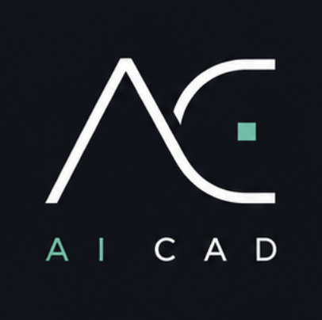
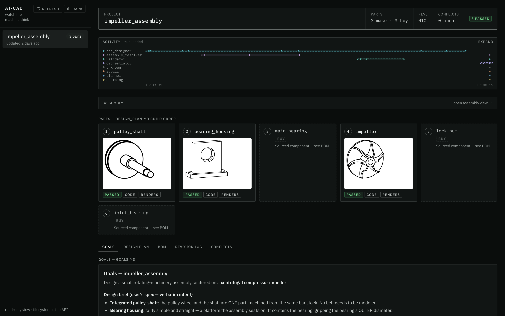
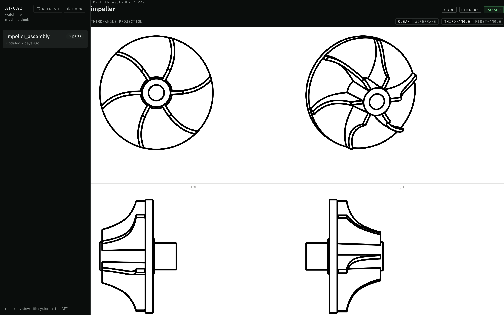
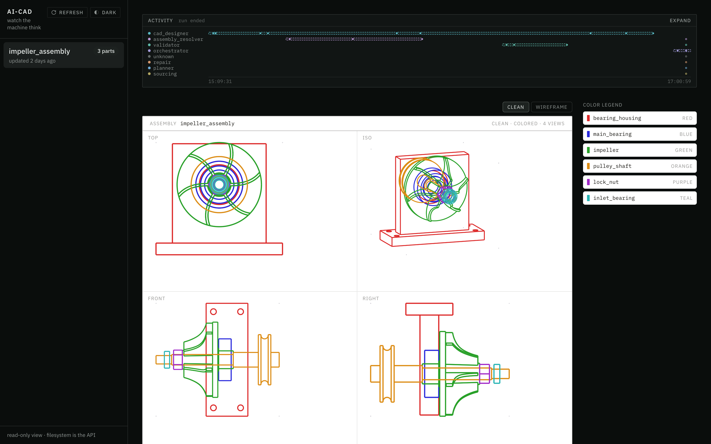
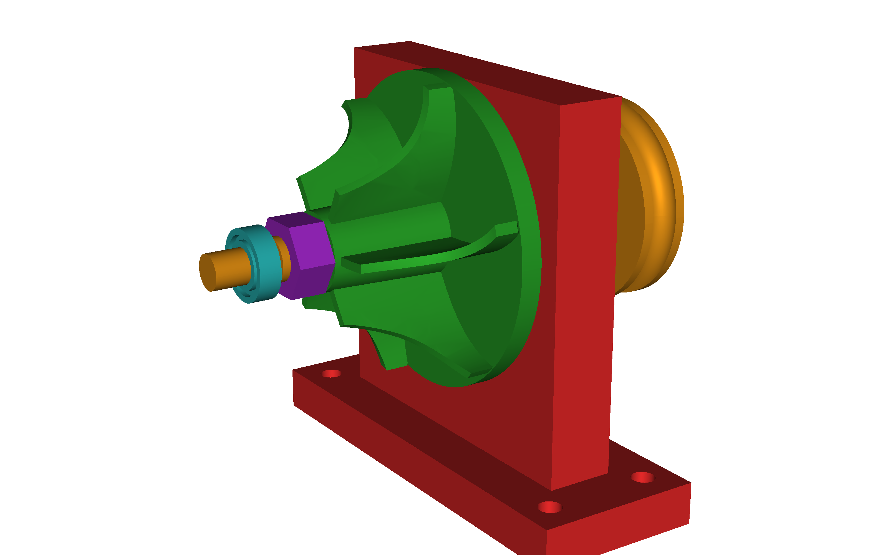

<div align="center">



[](pyproject.toml)
[](https://github.com/CadQuery/cadquery)
[](tests/)
[](https://www.anthropic.com/claude-code)
[](LICENSE)

> **Topics:** `ai-cad` · `text-to-cad` · `cadquery` · `generative-design` · `multi-agent` · `design-for-manufacturing`

[Quickstart](#get-exploring--quickstart) |
[Runs Gallery](#design-runs-gallery) |
[Case Study](#case-study) |
[FAQ](#faq) |
[Docs](docs/README.md) |
[Dev Setup](docs/dev/local-setup.md) |
[Discussions](https://github.com/ai-cad-labs/ai-cad/discussions)
[Issues](https://github.com/ai-cad-labs/ai-cad/issues)

</div>

# AI-CAD : An OSS multi-agent harness for Mech. Eng. CAD

_AI-CAD is an autonomous engineering department you commission,_

_AI-CAD is not a CAD modeling tool you operate._

Give it a plain-English brief or a hand-drawn sketch,
and a team of LLM agents delivers real, manufacturable parts and assemblies:

- **Plans** : the machine and decomposes it into parts
- **Writes** : parametric [CadQuery](https://github.com/CadQuery/cadquery) Python code
- **Renders** : every part to engineering views, and **looks** at them
- **Critiques** : the geometry against design-for-manufacturing and design-for-assembly rules
- **Repairs** : and re-judges until the design **survives review and delivers your intent**

_Agents **looking** at what they built, and **argue about it** until it **survives review** and **delivers your intent**_

All of this interactively inside your coding agent of choice,
and with visibility in a [**live dashboard**](#live-dashboard).

Every run writes a simple directory of files
that you can read, diff, and version like any other engineering record.

There is **no server** and **no database**.
AI-CAD is built on top of your **coding-agent**.

<div align="center">



_Your engineering department at work:
parts land as agents deliver, verdicts post,
and the [activity waterfall](#live-dashboard) traces every agent in real time._

</div>

---

## Guiding Design Principles

### Defends design intent

    The system refuses generic manufacturing advice
    that contradicts the intent and machine goals.

> (See [the run that argued back](#case-study).)

### Design machine components as stateful Python code (not immutable mesh props)

    Unlike most text-to-3D tools that generate meshes
    (excellent for game assets and concept art),

    AI-CAD writes parametric CAD code:
    every part is a Python program with named dimensions,

    exporting STEP and STL that a machine shop or downstream CAD system accepts.

### [Manufacturability is a hard gate, not an afterthought](docs/architecture-decision-records/0006-regression-gated-repair.md)

    A DFM/DFA rulebook scores each design;
    repair proposals that worsen the score are automatically rejected
    by a regression gate with full traceability.

### [Agents that see](docs/architecture-decision-records/0010-vision-based-dfma-with-analytical-backstops.md)

    Every part and assembly is rendered to 8 engineering views
    (front / top / right / iso, in wireframe and clean styles).

    A vision-capable evaluator agent sees those renders:
    geometry is judged from engineering lenses, not just executed.

### [Harness-agnostic](docs/architecture-decision-records/0002-shared-canonical-layer-with-harness-symlinks.md)

    Canonical agent, skill, and tool content lives once in `.shared/`;
    each harness (`.claude/`, `.opencode/`) is a thin symlinked shell over it.

### [The filesystem is the API](docs/architecture-decision-records/0004-filesystem-is-the-message-bus.md)

    Every run writes a self-describing project directory:
    goals, design log, per-part geometry, negotiation records, reflections.
    Exports STEP and STL for every part.
    No opaque database for facts to hide behind:
    the frontend, replay, and analysis all read the same files.

### [Deterministic tool layer](docs/architecture-decision-records/0003-bash-first-deterministic-tool-layer.md)

    Geometry execution, rendering, DFMA evaluation, spec validation, dimension checks, and export
    are deterministic bash-callable Python tools.

    Validation happens independently of any LLM.

### [Mortality-proof orchestrator](docs/architecture-decision-records/0012-mortal-orchestrator-filesystem-resume.md)

    If the orchestrator agent is killed, or runs out of context window,
    a fresh one reconstructs all state from the project directory alone.

    That is also how a crashed run resumes: no checkpoint database needed.

### [Runs debrief themselves](docs/architecture-decision-records/0017-run-reflection-every-run-debriefs-itself.md)

    A run reaches terminal state by writing a structured `run_reflection.md`:
    what failed, what the run improvised to protect the result,
    and what would make the next run smarter.
    Agentic telemetry ships judgment, not just logs.

The full set of architecture decision records, 
with the alternatives each one rejected, lives in 

[`docs/architecture-decision-records/`](docs/architecture-decision-records/README.md)

---

<div align="center">



_Eight views per part, judged like a drawing sheet:
this is what the vision evaluator sees before any geometry ships._

</div>

## What a Design run produces

One brief in, one self-describing artifact tree out.

> This is the real tree of the run in the public gallery, an IC-engine core designed at top-dead-center:
>
> [`piston_crank`](https://github.com/ai-cad-labs/ai-cad-example-projects/tree/main/piston_crank)

```text
projects/piston_crank/
├── goals.md              # the brief, expanded into measurable success criteria
├── design_plan.md        # parts, interfaces, the locked dimension chain, build order
├── design_log.md         # the agents' step-by-step build log
├── external/             # BOM + sourcing notes for catalog parts
├── assembly/
│   ├── piston/
│   │   ├── part.py       # the CadQuery source the agents wrote
│   │   ├── renders/      # the 8 engineering views the evaluator looked at
│   │   └── exports/      # piston.step + piston.stl
│   ├── crankshaft/           # ... same layout per part
│   ├── connecting_rod/
│   ├── gudgeon_pin/
│   ├── piston_ring/
│   └── renders/          # multi-view renders of the assembled mechanism
├── checkpoint.md         # optional handover note; resume rebuilds from files alone
└── run_reflection.md     # the run's own debrief
```

---

<a name="live-dashboard"></a>

<details>
<summary>
<h2>Live Dashboard : Watch the machine think</h2>

<div align="center">



_2 hours of autonomous design, traced live:
the agent waterfall above,
the assembly taking shape in four engineering views._

</div>

</summary>

A read-only local dashboard renders live runs:
drawing sheets, assembly negotiations, and a live agent activity waterfall.

```bash
cd frontend
npm install
npm run dev
# open http://localhost:5199
```

The dev server is pinned to **port 5199** (`strictPort`) on purpose:
it never imports harness code and never writes;
it only reads `projects/`.

See [`frontend/README.md`](frontend/README.md).

</details>

---

<details>
<summary>
<h2>Agent Roles</h2>

The department roster.

Each role is defined by one instructions file
</summary>

- [`orchestrator`](.shared/agents/orchestrator/instructions.md) - Runs the department. Mortality-proof by design: it can end mid-run and a successor rebuilds everything from files alone.
- [`planner`](.shared/agents/planner/instructions.md) - Decomposes a goal into parts, interfaces, and build order, and marks which parts are `parallel_safe` to build concurrently.
- [`cad_designer`](.shared/agents/cad_designer/instructions.md) - Writes the CadQuery, adapting proven cookbook patterns instead of improvising raw API calls.
- [`validator`](.shared/agents/validator/instructions.md) - Settles disputes numerically: structural checks and geometry measurements that outrank anyone's opinion, including the vision evaluator's.
- [`dfma_inspector`](.shared/agents/dfma_inspector/instructions.md) - Reads the renders and scores the design against the DFM/DFA rulebook.
- [`repair`](.shared/agents/repair/instructions.md) - Fixes geometry, but only via `part.proposal.py`; the regression gate decides whether the fix ships.
- [`assembly_resolver`](.shared/agents/assembly_resolver/instructions.md) - Fits the parts together and records the negotiations between them.
- [`sourcing`](.shared/agents/sourcing/instructions.md) - Selects catalog components and catches catalog traps (a bearing 1 mm thinner than assumed, a nut standard that would overhang its seat).
- [`reviewer`](.shared/agents/reviewer/instructions.md) - The final ship or no-ship verdict.

</details>

<details>
<summary>
<h2>Agent skills</h2>

The knowledge layer the agents draw on.

Skills are versioned documents ,you can read exactly what the system believes.
</summary>

- [`cadquery-cookbook`](.shared/skills/cadquery-cookbook/) - 11 reusable CadQuery patterns, 8 design principles, and 6 anti-patterns; designers adapt the closest pattern rather than composing from raw API calls.
- [`cadquery-anti-hallucination`](.shared/skills/cadquery-anti-hallucination/) - A catalog of CadQuery methods that do not exist but LLMs keep inventing, each with the correct alternative, plus the runtime error-to-hint table the executor applies.
- [`dfm-rules`](.shared/skills/dfm-rules/) - The agent-readable digest of the DFM/DFA rulebooks: every rule's id, severity, and fix hint, plus the scoring arithmetic and the rule-proposal schema.
- [`run-reflection`](.shared/skills/run-reflection/) - The schema and quality bar for the structured self-debrief every run writes at terminal state.
- [`engineering-handbooks`](.shared/skills/engineering-handbooks/) and [`sourcing-tables`](.shared/skills/sourcing-tables/) - Reserved stubs for machine-design playbooks and component tables, labeled provisional so no agent mistakes an empty slot for authority.

</details>

<details>
<summary>
<h2>Agent tools</h2>

The deterministic half of the system:

bash-callable Python modules (`uv run python -m tools.<name>`)
that measure, render, score, and export.

Agents decide; tools verify.
</summary>

- [`cadquery_executor`](.shared/tools/cadquery_executor.py) - Runs generated CadQuery code; a `--subprocess` flag isolates native OCCT crashes so one bad kernel call cannot take the run down.
- [`renderer`](.shared/tools/renderer.py) - Produces the 8 engineering views per part and assembly (4 views by 2 styles) as individual PNGs.
- [`dfma_evaluator`](.shared/tools/dfma_evaluator.py) - Scores designs against the rulebook and judges repair proposals with severity-weighted scoring (critical=10, major=5, minor=1); proposals that raise the score are auto-rejected with full traceability.
- [`dimension_checker`](.shared/tools/dimension_checker.py) - Deterministic bounding-box-versus-constraints verification: dimensions are measured, never asserted.
- [`spec_validator`](.shared/tools/spec_validator.py) - Project state scanner and structural artifact checks; also how a resumed run reconstructs where it was.
- [`exporter`](.shared/tools/exporter.py) - Exports finished parts to manufacturable formats (STEP, STL).
- [`placeholder_detector`](.shared/tools/placeholder_detector.py) - Answers "is this `part.py` a real design or a scaffold stub?" before anyone spends a render and a vision cycle on it.

</details>

<a name="dfma-rulebook"></a>

<details>
<summary>
<h2>DFMA Rulebook Mechanism</h2>

DFMA as a unit-test suite for generate part code

</summary>

DFM/DFA rules live as JSON in [`rules/`](rules/),
with `.proposed` siblings and a lifecycle log.

Rules are not frozen doctrine:
they can be proposed, promoted, or retired over time,
and every repair proposal is judged against them
by the regression gate in `dfma_evaluator`.
Think of DFMA as a unit-test suite for parts.

How the lifecycle got this shape, and what was rejected:
[decision record 0007, the central rules lifecycle](docs/architecture-decision-records/0007-central-rules-lifecycle.md).

</details>

---

## Design Runs Gallery

Real, unedited design runs live in the public gallery:
[`ai-cad-labs/ai-cad-example-projects`](https://github.com/ai-cad-labs/ai-cad-example-projects).
Every run ships its spec, plan, step-by-step design log, per-part geometry,
multi-view renders, STEP/STL exports, and its own debrief.
No geometry there was human-authored.

| Run | What it built | The numbers | Wall clock |
|---|---|---|---|
| [`impeller_assembly`](https://github.com/ai-cad-labs/ai-cad-example-projects/tree/main/impeller_assembly) | A belt-driven centrifugal compressor core, from a hand-drawn sketch ([the case study](#case-study)) | 6 components (3 designed, 3 catalog) · 0.8000 mm clearance measured five ways · 6 backswept blades at 10.5° · reviewer verdict: ship | ~2h12m |
| [`piston_crank`](https://github.com/ai-cad-labs/ai-cad-example-projects/tree/main/piston_crank) | The 5-part IC-engine core at top-dead-center | 7-instance assembly · a locked dimension chain that held end-to-end · mid-run self-checkpoint and cold resume | 71.3 min |
| [`spur_gear`](https://github.com/ai-cad-labs/ai-cad-example-projects/tree/main/spur_gear) | A meshing involute gear pair | Deterministic mesh proof: 0.00 mm³ interference at the correct half-tooth phase · 0 repair cycles | ~49.8 min |
| [`treasure_chest`](https://github.com/ai-cad-labs/ai-cad-example-projects/tree/main/treasure_chest) | The control baseline: a 4-part chest | 13 agents, 0 failures, 0 repairs · 3 findings deferred with written reasoning | 32.8 min |

<a name="case-study"></a>

<details>
<summary>
<h2>Case Study : Impeller Assembly : the run that argued back</h2>

<div align="center">



**Designed end-to-end from a single hand-drawn sketch:**
_a six-component impeller rig assembly,
rendered from the design run's assembly geometry._

Details: the [`impeller_assembly`](https://github.com/ai-cad-labs/ai-cad-example-projects/tree/main/impeller_assembly) run in the public gallery.

</div>

</summary>

The best argument for the architecture is a run where the system
disagreed with its own tooling and was right.
Every claim below is on file in the public exhibit:

[`impeller_assembly`](https://github.com/ai-cad-labs/ai-cad-example-projects/tree/main/impeller_assembly).

The input was a hand-drawn cross-section sketch and a five-bullet brief:
a belt-driven centrifugal compressor core with backswept blades.

Moments from that run show what a manufacturing gate with judgment looks like:

- **The system defended the user's design intent against its own evaluator.**
  Mid-run, the DFM evaluator (judging the wheel under a mis-selected
  3-axis milling ruleset) recommended cutting the impeller to 4 blades
  and straightening them into flat radial walls.
  That advice would have quietly destroyed exactly what the brief asked for.
  Both orchestrator generations refused it,
  recorded the refusal in `open_issues.md`,
  and passed an explicit do-not-comply guard downstream
  so no later agent could obey it by accident.
- **The headline requirement shipped as a machined dimension.**
  The brief asked for 0.5 to 1.0 mm of running clearance;
  the run delivered 0.8000 mm,
  confirmed by five independent measurements
  and realized structurally in a part,
  not left to an assembly stack-up that can drift.

User intent held as a first-class constraint,
not one voice in a negotiation the tooling usually wins.
The full record, refusals included, is public and unedited:

  6 STEP/STL exports,
  fourteen agent spawns across 2 sessions,
  roughly 2h12m of autonomous work, one repair cycle,
  reviewer verdict: ship.

The complete provenance chain,
from sketch to brief to per-part geometry to the run's own debrief,
is public:
[`impeller_assembly`](https://github.com/ai-cad-labs/ai-cad-example-projects/tree/main/impeller_assembly)
[`run_reflection.md`](https://github.com/ai-cad-labs/ai-cad-example-projects/blob/main/impeller_assembly/run_reflection.md).

[Read the full exhibit](https://github.com/ai-cad-labs/ai-cad-example-projects/tree/main/impeller_assembly) | [Browse all runs](https://github.com/ai-cad-labs/ai-cad-example-projects)

</details>

---

## Get Exploring : Quickstart

### Harness and platform support

| Platform | Linux | macOS | Windows |
|---|:---:|:---:|:---:|
| **AI-CAD** | ✅ | ✅ | ✅ <sup>*</sup> |

> * Windows :
>
> The repo depends on in-repo symlinks.
>
> Clone with `git clone -c core.symlinks=true`
> (Developer Mode or admin rights)
>
> Or work inside WSL

| Harness | Status | Notes |
|---|---|---|
| **[Claude Code](https://www.anthropic.com/claude-code)** | ✅ Supported (default) | The `claude` CLI carries its own authentication |
| **OpenCode** | 🚧 In progress | The `.opencode/` symlinked shell ships; the parallel build is open work |
| **Other harnesses** | 🗺️ Planned | `.shared/` holds all canonical content, so a new harness is a thin adapter |

### Prerequisites

- **Python 3.13+** and [`uv`](https://docs.astral.sh/uv/) (dependency + venv manager).
- **[Claude Code](https://www.anthropic.com/claude-code)**, the default harness.
  No API keys and no `.env`:
  the `claude` CLI carries its own authentication.
- **cairo**: the renderer converts SVG to PNG via `cairosvg`,
  which needs the system cairo library.
  macOS: `brew install cairo`
  (the renderer auto-sets `DYLD_FALLBACK_LIBRARY_PATH` for Homebrew).
  Debian/Ubuntu: `apt-get install libcairo2`.
- **Windows**: clone with `git clone -c core.symlinks=true`
  (requires Developer Mode or admin rights), or work inside WSL.
  The repo relies on in-repo symlinks
  (`tools`, `.claude/agents`, `.claude/skills` point into `.shared/`);
  a default Windows clone materializes them as plain text files,
  which breaks Python imports and agent discovery.

### Install

```bash
git clone https://github.com/ai-cad-labs/ai-cad.git
cd ai-cad
uv sync            # creates .venv and installs the tool layer
uv run pytest -q   # ~163 tests should pass: confirms the CAD/DFMA engine works
```

### Launch a design run

Open the repo in Claude Code and prompt as such:

```text
create a project with a `goals.md` for <YOUR IDEA>
and dispatch the orchestrator to design it to completion.
```

### Follow the run

Watch `projects/<name>/` fill in as the agents work,
or open the [live dashboard](#live-dashboard).
The filesystem is the source of truth:
goals, design plan, per-part CadQuery source, renders, measurements, exports.

### Resume a previous run

Relaunch with an entry prompt that says RESUMING and names the project directory;
the fresh orchestrator reconstructs state from the files alone.

---

## Stack Acknowledgements

AI-CAD writes [CadQuery](https://github.com/CadQuery/cadquery),
the parametric Python CAD system that makes code-as-geometry possible.
Rendering goes through `cairosvg` and the system cairo library.
The default harness is [Claude Code](https://www.anthropic.com/claude-code),
and the dashboard stands on Vite, React, and Tailwind.

## Getting help

- **Questions and problems**: open an issue on
  [github.com/ai-cad-labs/ai-cad](https://github.com/ai-cad-labs/ai-cad).
- **"What should healthy output look like?"**: study a complete run in the
  [run gallery](https://github.com/ai-cad-labs/ai-cad-example-projects)
  before changing pipeline behavior.
- **Conventions and internals**: [`AGENTS.md`](AGENTS.md) is the canonical map
  for anyone (human or agent) working in the repo.
- **Why the system is built this way**: [`docs/README.md`](docs/README.md)
  indexes the documentation layer:
  the [glossary](docs/glossary.md) of domain language
  and the [architecture decision records](docs/architecture-decision-records/README.md)
  that carry each design decision and the alternatives it rejected.
- **CadQuery itself**: the `reference/` directory ships five distilled CadQuery
  reference documents, which are all the system needs at runtime.
  For deeper work, [`docs/dev/local-setup.md`](docs/dev/local-setup.md)
  lists the nine upstream CadQuery ecosystem repos worth cloning locally.

## Contribution Invitation

Contributions are welcome, and we want you to feel welcome making them.

You do not need to be a CAD veteran
or a machine-learning engineer to have a big impact:
documentation, DFM/DFA rule improvements, gallery runs,
and issue reports all move the project forward.

| Channel | Best for |
|---|---|
| [Issues](https://github.com/ai-cad-labs/ai-cad/issues) | Bugs and defects |
| [Discussions](https://github.com/ai-cad-labs/ai-cad/discussions) | Show your runs, ask questions, propose machines |

**Reporting a bug**:

open an issue answering three questions.
Your environment (OS, Python, harness version),
what you asked for (the prompt or the run's `goals.md`),
and what happened
(attach the tail of `design_log.md`, `open_issues.md`,
and `run_reflection.md` if the run wrote one).
The project directory is the reproduction case:
it usually contains everything a maintainer needs.

**Suggesting a feature or a rule**:

open an issue describing the change and why it matters.
DFM/DFA rule proposals are a first-class contribution surface:
the rulebooks in [`rules/`](rules/) have a documented proposal schema
(see the [`dfm-rules`](.shared/skills/dfm-rules/) skill),
and rules can be proposed, promoted, or retired over time
(the [DFMA Rulebook Mechanism](#dfma-rulebook) above).

## FAQ

<details>
<summary><b>Do I need API keys or a <code>.env</code>?</b></summary>
<br>

No.
The `claude` CLI carries its own authentication,
and the repo ships no `.env` by design.

> (Decision record: [0008, one model engine, no keys](docs/architecture-decision-records/0008-claude-cli-as-single-model-engine.md).)

</details>

<details>
<summary><b>What CAD outputs does it produce?</b></summary>
<br>

Per part: parametric CadQuery source (`part.py`),
STEP and STL exports,
and 8 engineering-view PNG renders.
Assemblies additionally get multi-view assembly renders
and assembly-level exports where present.

</details>

<details>
<summary><b>Can it run unattended?</b></summary>
<br>

Yes.
Runs launch headless via `claude -p`,
and the mortality-proof orchestrator design means a crashed run
resumes from the project directory alone:
no checkpoint file is needed.

> (Decision record: [0012, the mortal orchestrator](docs/architecture-decision-records/0012-mortal-orchestrator-filesystem-resume.md).)

</details>

<details>
<summary><b>How do the agents coordinate?</b></summary>
<br>

Through the filesystem.
Nine roles read and write one self-describing project directory:
goals, plan, design log, per-part geometry, negotiation records, reflections.
Nothing hides in a database,
and the frontend, replay, and analysis all read the same files.
> (Decision record: [0004, the filesystem is the message bus](docs/architecture-decision-records/0004-filesystem-is-the-message-bus.md).)

</details>

<details>
<summary><b>Is the legacy PydanticAI repo maintained?</b></summary>
<br>

It is frozen and kept for its research value.
Feature work happens in this repo.

> Why the project moved from that implementation to a coding-agent harness is the founding decision record:
> [0001, Claude Code as the agent runtime](docs/architecture-decision-records/0001-claude-code-as-the-agent-runtime.md).

</details>

<details>
<summary><b>Does it work on Windows?</b></summary>
<br>

Yes: clone with `git clone -c core.symlinks=true`
(requires Developer Mode or admin rights),
or work inside WSL.
A default Windows clone materializes the repo's symlinks as plain text files,
which breaks Python imports and agent discovery.

</details>

<details>
<summary><b>Can I run it on a harness other than Claude Code?</b></summary>
<br>

That is the design intent.
Canonical agent, skill, and tool content lives once in `.shared/`,
and each harness directory (`.claude/`, `.opencode/`)
is a thin symlinked shell over it.
Claude Code is the tested default today;
the OpenCode build is open work.

> (Decision record: [0002, the shared canonical layer](docs/architecture-decision-records/0002-shared-canonical-layer-with-harness-symlinks.md).)

</details>

---

## License

Licensed under the [Apache License 2.0](LICENSE).

See [`NOTICE`](NOTICE) for attribution;
the NOTICE attribution travels with every redistribution.

<details>
<summary><h2>Citing AI-CAD</h2></summary>

```bibtex
@software{ai_cad,
  title   = {AI-CAD: a multi-agent mechanical CAD harness},
  author  = {{Saif Raja on behalf of the ai-cad-labs project}},
  year    = {2026},
  url     = {https://github.com/ai-cad-labs/ai-cad},
  license = {Apache-2.0}
}
```

</details>

---

If you read this far,
open an issue with the machine you want designed, \
and it **will** get run.

**⭐ If AI-CAD is useful to you, please consider giving it a star! It helps⭐**

---

<div align="center">

_Part of the **[ai-cad-labs](https://github.com/ai-cad-labs)** project._

_Maintained by [@saif-raja](https://github.com/saif-raja) on behalf of **AI-CAD Labs**._

_**Copyright** (C) 2026, per [LICENSE](LICENSE)._

</div>
