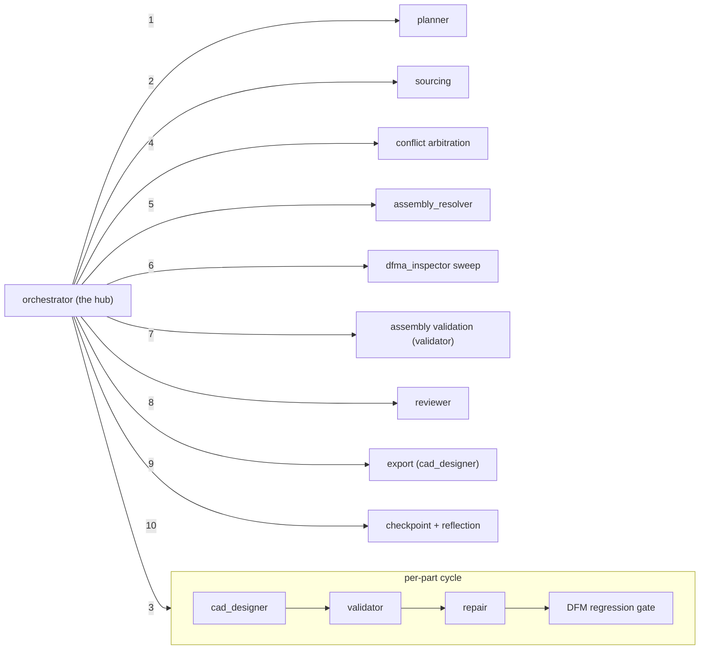
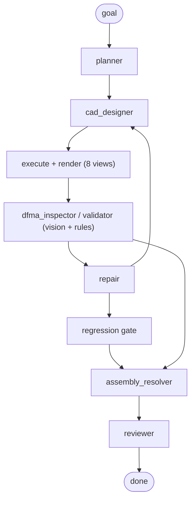

# Documentation index

## How this repo is documented

Code is the source of truth in this repository.
The agent instructions and skills under `.shared/` are the program itself:
executable markdown the harness runs, not documentation about it.
This folder carries only what code cannot say:
architecture decision records ([`architecture-decision-records/`](architecture-decision-records/README.md)),
the domain language ([`glossary.md`](glossary.md)),
and thin navigation like this page.
On any conflict between a doc and the code, the code wins,
and the doc gets fixed or deleted in the same change.

Contributor gate: a new doc here must be an architecture decision record,
a glossary entry, or a map-altitude pointer
(where something lives and what it is for);
anything that explains how the code works belongs in the code.

## The map

One line per top-level area.
For the full tree and the operating rules, read [`AGENTS.md`](../AGENTS.md).

| Area | What it is |
|---|---|
| [`.shared/agents/`](../.shared/agents/) | The agent role definitions, one `instructions.md` per role; the executable flow of a design run |
| [`.shared/skills/`](../.shared/skills/) | The knowledge layer agents invoke: CadQuery cookbook, anti-hallucination traps, DFM rules mechanics, run reflection |
| [`.shared/tools/`](../.shared/tools/) | Deterministic, bash-callable Python tools underneath the agents; see the tool table below |
| [`rules/`](../rules/) | The DFM/DFA rulebooks (JSON), their proposed-rule siblings, and the append-only lifecycle log |
| [`reference/`](../reference/README.md) | Distilled CadQuery reference docs, everything the system reads at runtime |
| `projects/` | Run output (untracked); each run writes a self-describing artifact tree, mapped below |
| [`frontend/`](../frontend/README.md) | The read-only run dashboard over `projects/` |
| [`tests/`](../tests/) | The tool-layer test suite |
| `docs/` | This folder: this index, the glossary, the ADRs, the generated API reference, and contributor setup |

## The Agentic Graph

The orchestrator is the hub: every handoff between roles passes through it.
The numbered spokes are the phase order of one design run;
the per-part cycle repeats for each part until it passes validation.

This flow is encoded in [`.shared/agents/`](../.shared/agents/)`*/instructions.md`;
on any conflict between this map and the instructions, the instructions win.

## Design Run Typical Flow

## The tool layer

Every capability underneath the agents is a deterministic Python tool,
invoked as `uv run python -m tools.<name>` from the repo root.
Each module docstring is that tool's full contract
(modes, output shape, exit semantics); this table only names and points.

| Tool | One-line purpose | Full contract |
|---|---|---|
| `cadquery_executor` | Runs CadQuery code in a controlled namespace and reports geometry results as JSON; can isolate execution in a child process that survives native kernel crashes | [module docstring](../.shared/tools/cadquery_executor.py) |
| `spec_validator` | Scans a project directory into a run-state report and structurally validates plans, constraints, and status markers; never executes CAD code | [module docstring](../.shared/tools/spec_validator.py) |
| `renderer` | Renders a part or assembly to the standard engineering-view PNGs, with per-part colors and a legend in assembly mode | [module docstring](../.shared/tools/renderer.py) |
| `dimension_checker` | Deterministic bounding-box check of built geometry against the constraints envelope | [module docstring](../.shared/tools/dimension_checker.py) |
| `exporter` | Executes a part and exports the solid to manufacturable STEP and STL files | [module docstring](../.shared/tools/exporter.py) |
| `placeholder_detector` | Cheap text-level gate that a part file is a real design rather than a scaffold stub | [module docstring](../.shared/tools/placeholder_detector.py) |
| `dfma_evaluator` | Vision-based DFM/DFA evaluation of rendered views, the rules lifecycle machinery, and the repair regression gate | [module docstring](../.shared/tools/dfma_evaluator.py) |

The module docstrings are the API reference.
Browse it at [`api/README.md`](api/README.md):
markdown generated from those docstrings
and freshness-gated by the test suite.

The suite in `tests/` covers this layer:
if `uv run pytest -q` is green, the tool engine underneath the agents works.

## What a run writes

A design run fills `projects/<name>/` with a self-describing artifact tree.
This table is navigation only:
the producing instructions and the consuming parsers are the contract,
and schemas live in those files, never here.
The frontend reads a subset;
rows without a consumer are producer-side lifecycle artifacts.

| Artifact | Role | Producer | Consumer |
|---|---|---|---|
| `goals.md` | The brief expanded into measurable success criteria | run launch (see the [`AGENTS.md`](../AGENTS.md) runbook) | [`model.ts`](../frontend/src/lib/model.ts) |
| `design_plan.md` | The planner's decomposition with locked parameter and interface tables | [planner](../.shared/agents/planner/instructions.md) | [`designPlan.ts`](../frontend/src/lib/parsers/designPlan.ts) |
| `design_log.md` | Chronological agent activity feed | all roles append, under the [orchestrator](../.shared/agents/orchestrator/instructions.md) convention | [`designLog.ts`](../frontend/src/lib/parsers/designLog.ts) |
| `open_issues.md` | The project conflict ledger | [assembly_resolver](../.shared/agents/assembly_resolver/instructions.md) | [`conflicts.ts`](../frontend/src/lib/parsers/conflicts.ts) |
| `checkpoint.md` | Optional handover baton from a checkpointing orchestrator | [orchestrator](../.shared/agents/orchestrator/instructions.md) | none |
| `smoke_report.md` | Outcome summary at run close | [orchestrator](../.shared/agents/orchestrator/instructions.md) | none |
| `run_reflection.md`, `reflection_notes.md` | The run's self-debrief for the improvement loop | [orchestrator](../.shared/agents/orchestrator/instructions.md), per the [run-reflection skill](../.shared/skills/run-reflection/SKILL.md) | none |
| `external/bom.md` | Bill of materials for purchased parts | [sourcing](../.shared/agents/sourcing/instructions.md) | [`bom.ts`](../frontend/src/lib/parsers/bom.ts) |
| `external/sourcing_notes.md` | Confirm-or-flag verdicts on catalog selections | [sourcing](../.shared/agents/sourcing/instructions.md) | none |
| `assembly/assembly.py` | The assembly composition source | [assembly_resolver](../.shared/agents/assembly_resolver/instructions.md) | none |
| `assembly/assembly.md` | The resolver's placement view of the assembly | [assembly_resolver](../.shared/agents/assembly_resolver/instructions.md) | [`model.ts`](../frontend/src/lib/model.ts) |
| `assembly/dfa_report.json` | The assembly's DFA evaluation report | [dfma_inspector](../.shared/agents/dfma_inspector/instructions.md) | [`dfma.ts`](../frontend/src/lib/parsers/dfma.ts) |
| `assembly/<part>/part.py` | The stable, gate-protected part code | [cad_designer](../.shared/agents/cad_designer/instructions.md) | [`model.ts`](../frontend/src/lib/model.ts) |
| `assembly/<part>/part.proposal.py` | A proposed replacement awaiting the regression gate | [repair](../.shared/agents/repair/instructions.md) | [`model.ts`](../frontend/src/lib/model.ts) |
| `assembly/<part>/constraints.md` | The part's binding spec | [planner](../.shared/agents/planner/instructions.md); [sourcing](../.shared/agents/sourcing/instructions.md) appends purchased-part interfaces | [`model.ts`](../frontend/src/lib/model.ts) |
| `assembly/<part>/notes.md` | Running validation conversation ending in the verdict line | [validator](../.shared/agents/validator/instructions.md) | [`notes.ts`](../frontend/src/lib/parsers/notes.ts) |
| `assembly/<part>/dfma_report.json` | The part's DFM evaluation report | [validator](../.shared/agents/validator/instructions.md) | [`dfma.ts`](../frontend/src/lib/parsers/dfma.ts) |
| `assembly/<part>/attempt_log.json` | Per-part attempt history | [cad_designer](../.shared/agents/cad_designer/instructions.md), [repair](../.shared/agents/repair/instructions.md), and the [orchestrator](../.shared/agents/orchestrator/instructions.md) append | [`attemptLog.ts`](../frontend/src/lib/parsers/attemptLog.ts) |
| `renders/` (per part and assembly) | The standard engineering-view PNGs, plus the color legend in assembly renders | [validator](../.shared/agents/validator/instructions.md) via the renderer tool | [`renders.ts`](../frontend/src/lib/parsers/renders.ts) |
| `assembly/<part>/exports/` | STEP and STL geometry for manufacture | [cad_designer](../.shared/agents/cad_designer/instructions.md) in export mode | none |

## Pointers

- [`api/README.md`](api/README.md): the tool-layer API reference, generated from the module docstrings.
- [`glossary.md`](glossary.md): the domain language, with per-term authority pointers into the code.
- [`architecture-decision-records/README.md`](architecture-decision-records/README.md): the architecture decision records index.
- [`dev/local-setup.md`](dev/local-setup.md): contributor environment setup, test suites, and the upstream reference workflow.
- [`frontend/README.md`](../frontend/README.md): the dashboard's own docs.
- [`reference/README.md`](../reference/README.md): the distilled CadQuery reference set.
- [`ai-cad-labs/ai-cad-example-projects`](https://github.com/ai-cad-labs/ai-cad-example-projects): the run gallery of real, unedited design runs.
